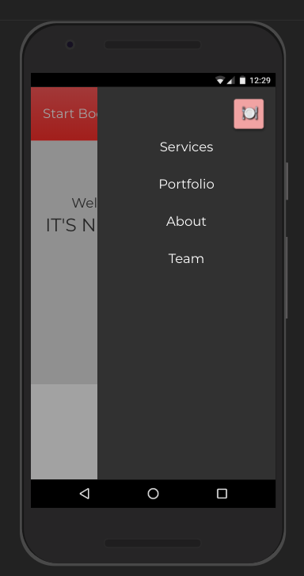
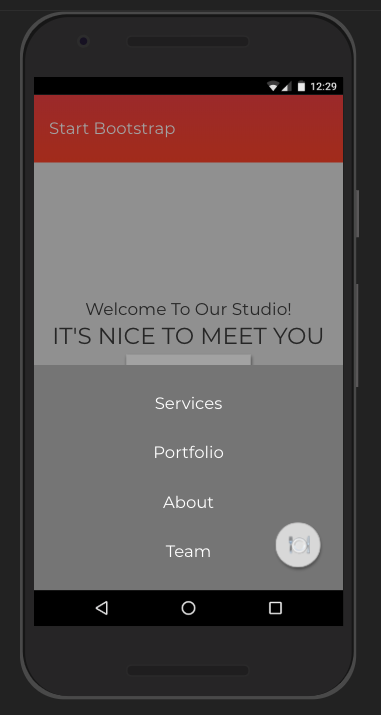
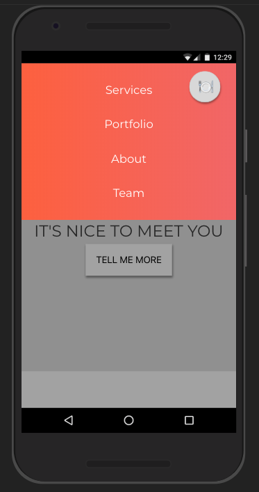
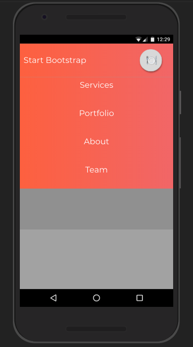
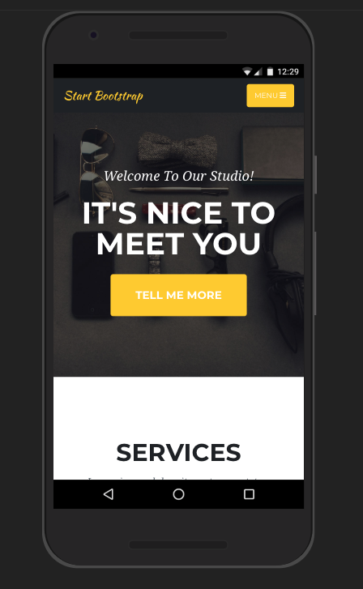
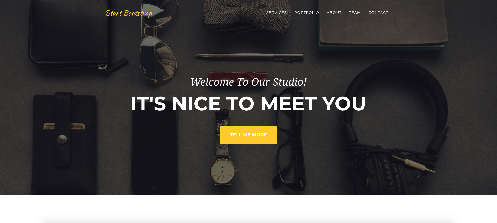

# HTML CSS Day III

## To Cover

<ul>
    <li>Responsive Design
        <ul>
            <li>max-width && width: 100%</li>
            <li>card components 300px max width</li>
            <li>Media Queries
                <ul>
                    <li>Min-width</li>
                    <li>Max-width</li>
                    <li>Min-width && max-width together</li>
                </ul>
            </li>
        </ul>
    </li>
    <li>CSS Animations
        <ul>
            <li>@keyframes
                <ul>
                    <li>from/to</li>
                    <li>percentages</li>
                </ul>
            </li>
            <li>Animations
                <ul>
                    <li>animation name</li>
                    <li>animation duration</li>
                    <li>iteration count</li>
                </ul>
            </li>
        </ul>
    </li>
    <li>Transitions
        <ul>
            <li>Make smooth transitions</li>
            <li>specific property transitions</li>
        </ul>
    </li>
</ul>

# Mini

## Choose one!

| From the side  | From the bottom | From the top | From under nav
| ------------- | ------------- | ------------- | ------------- | 
|   |   |  | 

# Afternoon 

## Site clone

### focus on responsive design

<a href="https://blackrockdigital.github.io/startbootstrap-agency/">Afternoon project</a>

| Mobile  | Desktop |
| ------------- | ------------- | 
|   |   |